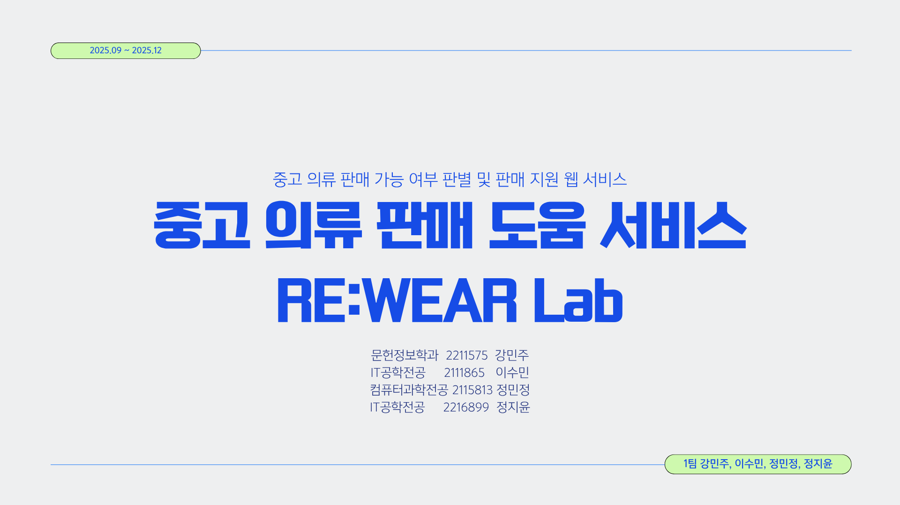
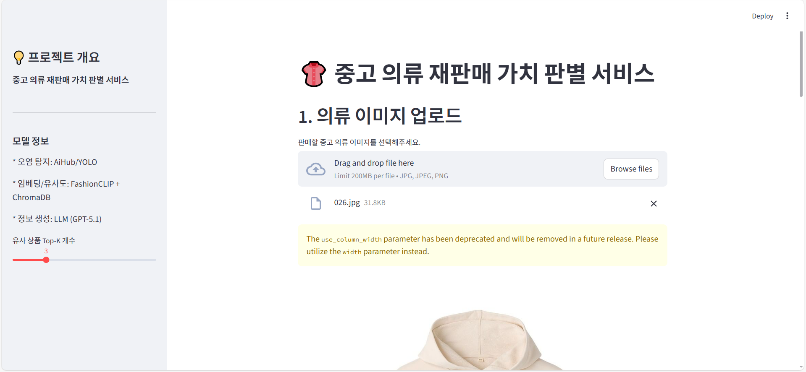
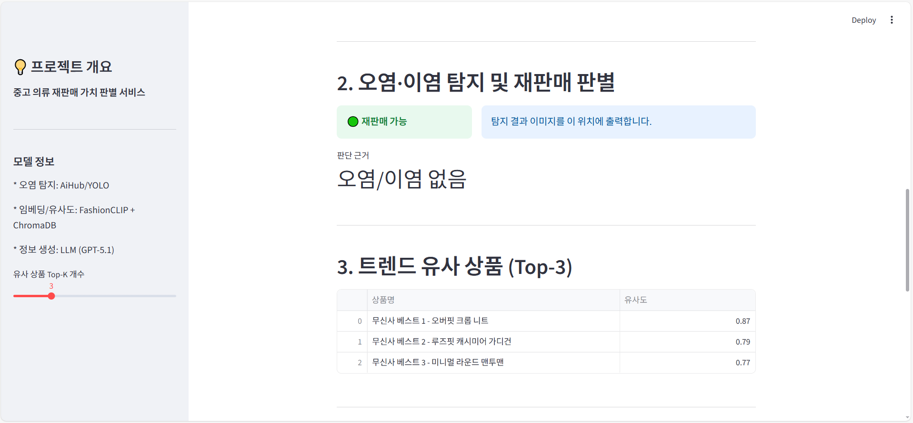
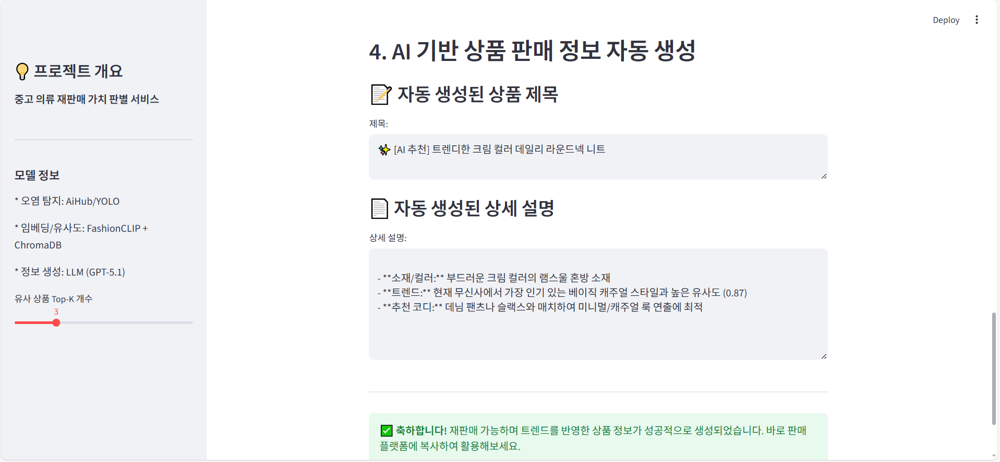
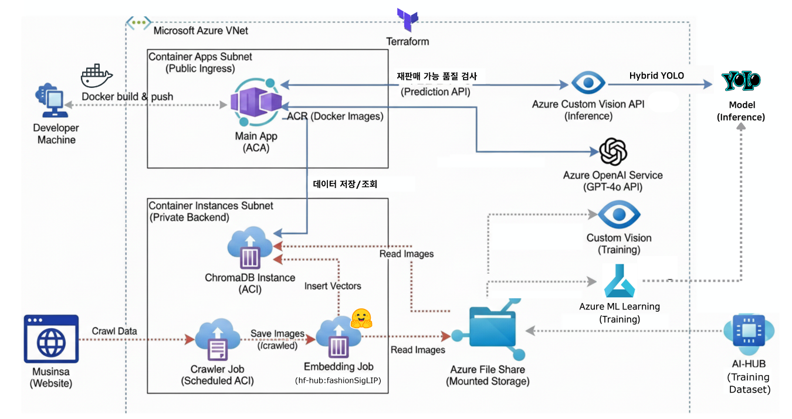

# 🧥 RE:WEAR Lab

<p align="center">
  
</p>

<p align="center">
  <b>AI 기반 중고 의류 재판매 자동화 플랫폼</b><br/>
  이미지 분석부터 가격 판단, 판매글 생성까지 End-to-End 지원
</p>

<br><br><br>

## 📌 프로젝트 개요

RE:WEAR Lab은 사용자가 업로드한 의류 이미지를 기반으로  
**재판매 가능 여부를 판단하고, 유사 상품과 가격 정보, 판매글까지 자동 생성하는 AI 서비스**입니다.

<br>

중고 의류 거래 과정에서 발생하는

- 판매 가능 여부 판단의 주관성  
- 적정 가격 산정의 어려움  
- 판매글 작성의 번거로움  

등의 문제를 해결하기 위해 **Computer Vision + LLM + Vector Search를 결합한 AI 파이프라인**을 구축했습니다.

<br><br><br>

## 📅 프로젝트 기간

- 2025.9 ~ 2025.12

<br><br><br>

## 👥 팀원 소개 및 담당 역할

| 이름 | 파트 | 담당 역할 |
|------|------|-----------|
| 강민주 | AI & ML | YOLOv8 기반 의류 오염 탐지 모델 개발 |
| 이수민 | Data & Backend | 트렌드 상품 크롤링 및 ETL 파이프라인 구축, ChromaDB 설계 |
| 정민정 | AI & ML | Azure Custom Vision 기반 객체 탐지 모델 개발 |
| 정지윤 | LLM & Frontend | Streamlit 웹 개발 및 Azure OpenAI 챗봇 구현 |

<br><br><br>

## ✨ 주요 기능

### 🌐 통합 웹 서비스
- 이미지 업로드 → 분석 → 추천 → 판매글 생성까지 통합 제공
- Streamlit 기반 UI + Azure Container Apps 배포 환경 구성
- 책임있는 UI 적용

<br><br>

### 🔍 1. 의류 상태 분석
- 의류 이미지 기반 오염 및 손상 여부 탐지
- 재판매 가능 여부 자동 판단
- YOLOv8 + Azure Custom Vision 기반 Hybrid Object Detection 모델 활용

<p align="center">
  
</p>

<br><br>

### 🧠 2. 유사 상품 추천
- 업로드 이미지와 유사한 최신 상품 추천
- 가격 / 브랜드 / 카테고리 정보 제공
- CLIP 기반 멀티모달 임베딩 + ChromaDB Vector Search 활용

<p align="center">
  
</p>

<br><br>

### ✍️ 3. 판매글 자동 생성
- 이미지 분석 결과 + 유사 상품 데이터 기반 생성
- Azure OpenAI GPT 모델 기반 자동 생성
- 프롬프트 엔지니어링을 통해 상품 정보에 맞는 텍스트 생성

<p align="center">
  
</p>

<br><br><br>

## 🧠 서비스 흐름

```bash
Image Upload
↓
[Vision Model]
↓
오염/손상 판단 → 판매 가능 여부 결정
↓
[Vector Search]
↓
유사 상품 추천
↓
[LLM]
↓
판매글 자동 생성
```

<br><br><br>

## 🧩 기술 스택

### 🤖 AI / ML

   


### ⚙️ Backend / Infra

  


### 🗄️ Data

 


### 🎨 Frontend


<br><br><br>

## 🏗️ 시스템 아키텍처
<p align="center">  </p>

- YOLOv8 + Custom Vision 기반 Hybrid 모델
- CLIP 기반 멀티모달 임베딩
- ChromaDB 기반 유사도 검색
- Azure 기반 클라우드 인프라 구성

> [자세한 내부 구조 설명 바로가기](https://github.com/GeeYun086/rewearlab-ai-project/tree/main/main)

<br><br><br>

## 📊 데이터 파이프라인

| 단계 | 설명 |
|------|------|
| Extract | Selenium 기반 상품 데이터 크롤링 |
| Transform | Object Detection 기반 전처리 및 이미지 정제 |
| Load | CLIP 임베딩 생성 후 ChromaDB 저장 |

<br><br><br>

## 📦 데이터 구성

| 데이터 | 설명 |
|--------|------|
| 폐의류 데이터 | 이미지 + JSON 라벨 (약 100,000개) |
| 상품 데이터 | 브랜드, 가격, 이미지, 카테고리 |

<br><br><br>

## 🔍 모델 정보

### 📌 모델 성능 요약

| 모델 | 역할 | Precision | Recall |
|------|------|----------|--------|
| YOLOv8 | 오염 탐지 | 0.677 | 0.627 |
| Custom Vision | 객체 탐지 | 31.7% | 25.5% |

<br><br>

### 🔍 유사 상품 검색
- CLIP 기반 512차원 임베딩
- Cosine Similarity 기반 검색
- 스타일 / 분위기까지 반영한 검색 가능

<br><br>

### ✍️ 판매글 생성 (LLM)
- Azure OpenAI 기반 GPT 모델 활용
- 입력: 이미지 분석 결과 + 유사 상품 데이터
- 출력: 상품 제목 및 상세 설명
- 프롬프트 엔지니어링으로 정확도 개선

<br><br><br>

## 🔮 개선 방향
- 데이터 증강을 통한 객체 탐지 성능 개선
- 가격 예측 모델 추가
- ETL 자동화 (Airflow / Cron)
- 중고 거래 플랫폼 연동

<br><br><br>

## 📂 프로젝트 구조
```text
rewearlab-ai-project/
├── img/
│   ├── analyze.png
│   ├── architecture.png
│   ├── generate.png
│   ├── poster.png
│   └── recommend.png
│
├── main/
│   ├── crawler/
│   │   ├── Dockerfile
│   │   ├── musinsa_crawler.py
│   │   └── requirements.txt
│   │
│   ├── data/
│   │   ├── 029b7944-313c-45f3-beb8-7603a5199b91/
│   │   ├── 054eabb6-329e-4ab4-82f3-a06e1b3b5d6d/
│   │   ├── 3ad600d2-1739-4fa1-96eb-6925d2c004b9/
│   │   ├── be9ccab6-9ee2-433e-9eb4-42e02f4e72f0/
│   │   └── chroma.sqlite3
│   │
│   ├── embedding/
│   │   ├── Dockerfile
│   │   ├── musinsa_to_chromadb.py
│   │   └── requirements.txt
│   │
│   ├── main-app/
│   │   ├── __pycache__/
│   │   ├── Dockerfile
│   │   ├── app.py
│   │   └── requirements.txt
│   │
│   ├── search-app/
│   │   ├── __pycache__/
│   │   ├── Dockerfile
│   │   ├── musinsa_detect.py
│   │   └── requirements.txt
│   │
│   ├── terraform/
│   │   ├── .gitignore
│   │   ├── chromadb.tf
│   │   ├── container-apps.tf
│   │   ├── main.tf
│   │   ├── network.tf
│   │   ├── openai.tf.bak
│   │   ├── outputs.tf
│   │   ├── providers.tf
│   │   ├── storage.tf
│   │   ├── terraform.tfvars.example
│   │   └── variables.tf
│   │
│   ├── .env.template
│   ├── ARCHITECTURE.md
│   ├── QUICKSTART.md
│   ├── README.md
│   └── docker-compose.yml
│
├── openai/
│   ├── .env
│   ├── input.json
│   └── rewearlab-openai.py
│
├── streamlit/
│   └── rewearlab-webapp.py
│
└── README.md
```

<br><br><br>

## 🖥️ 실행 방법
```bash
git clone https://github.com/GeeYun086/rewearlab-ai-project.git
cd rewearlab-ai-project

pip install -r requirements.txt
streamlit run app.py
```
